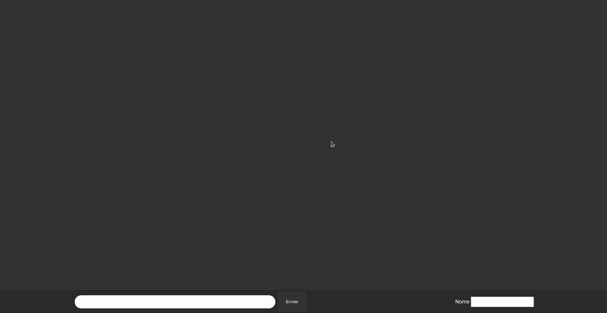

<div align="center">
  <h2>Chat com Socket.io #ProjectByDay[2-5]</h2>
    
  <p>Socket.io é uma ferramenta incrível, a documentação é simples e direta. Com toda certeza vale a pena estudar mais a fundo essa biblioteca.</p>
  
  </br>
  </br>
  <h3>Esse projeto é parte de um outro projeto na qual eu chamo de #ProjectByDay</h3>
  
<div align="start">
<h3>#ProjectByDay. Qual é o propósito disso?</h3>

 A ideia não é criar projetos extremamente trabalhosos, e sim projetos simples que não me atrapalhem nas obrigações do dia a dia, focando em conceitos básicos e os reforçando. Talvez em um projeto só tenha um ponto interessante, essa é a questão.
 </div>

</div>

<div align="start">
<h2>Get started:</h2>
<p>Mas antes, precisamos de dois pacotes instalados na máquina.</p>
<h2><a href="https://nodejs.org/">Node</a></h2> e </br>
<h2><a href="https://yarnpkg.com/">Yarn</a></h2>

```
Após o Node e o Yarn serem instalados com sucesso. Execute os seguinte comandos:
1. Entre na pasta do projeto.
2. Execute o comando "yarn" no terminal para instalar as dependencias.
3. Depois que todas as dependências forem instaladas, execute o comando "yarn dev".
O server se inicializará na porta 3000.
4. Não havendo nenhum problema com a porta 3000, abra o terminal e acesse o localhost na mesma porta.
```

</div>


</br>
<h4 align="center">Fique a vontade pra entrar em contato, networking sempre é bom  😁</h4>

<p align="center">  
&nbsp; <a href="https://www.linkedin.com/in/igor-araujo-cruz-84a89111b/" target="_blank" rel="noopener noreferrer"></a>
&nbsp; <a href="mailto:igoraraujocruzz@gmail.com" target="_blank" rel="noopener noreferrer"></a>
</p>